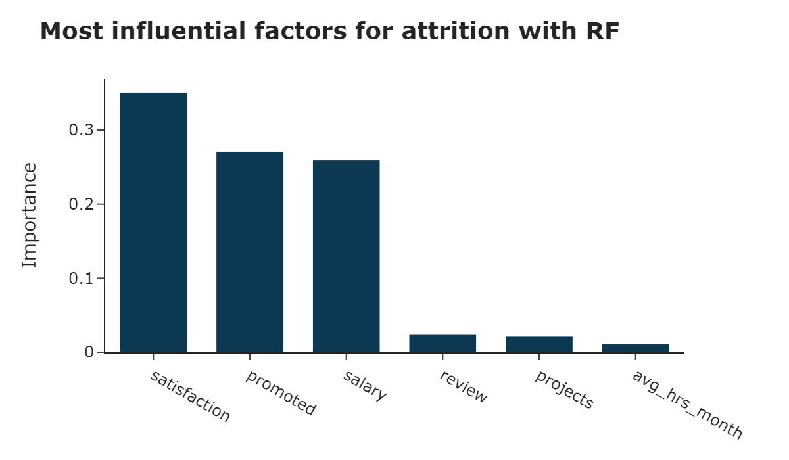

# Reducing employees attrition 

The purpose of this report is to describe results obtained from a model that predicts and identifies employees that will likely churn.

## *Why is this a problem?*

1. It is difficult to find suitable replacements for employees

2. It takes time, effort, and money to recruit new employees.

3. Loss of an employee adversely affects ongoing projects and services, leading to dissatisfaction among customers and other stakeholders.

4. It takes time and effort for new employees to achieve the same levels of expertise and productivity.

5. Loss of an employee costs money. Churn rates can be as high as 12-15% annually.

## Results

## Recomendations for retention

Build programs targeting issues such as...

- Reward and recognition
- Promotion and oportunity to grow
- Participation in decision making
- Work life and balance
- Work envrionment
- Investing in training and development
- Leadership
- Job security

## Reference

1. Saradhi, V. V., & Palshikar, G. K. (2011)

2. Hussain, T. & Deery, S. Why do self-initiated expatriates quit their jobs: The role of job embeddedness and shocks in explaining turnover intentions. International Business Review 27, 281–288 (2018).

3. Qudrat-Ullah, H. Improving Human Performance in Dynamic Tasks: Applications in Management and Industry. (Springer International Publishing, 2020). doi:10.1007/978-3-030-28166-3